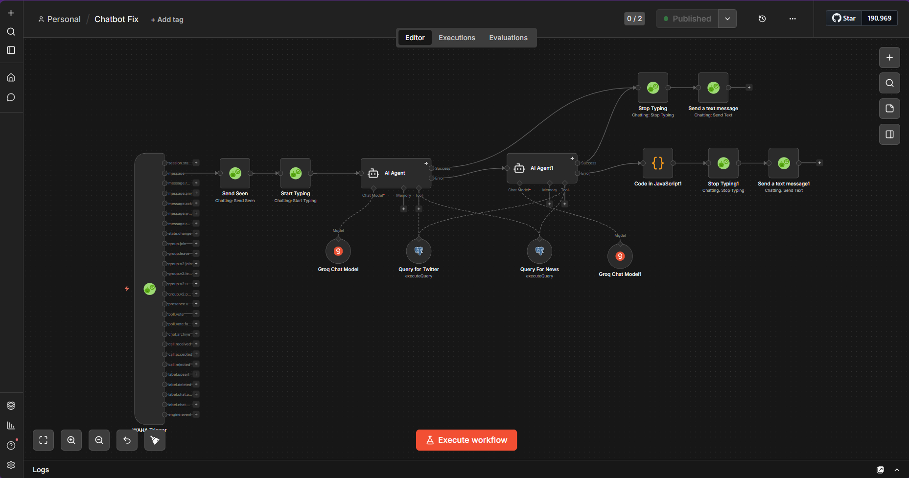
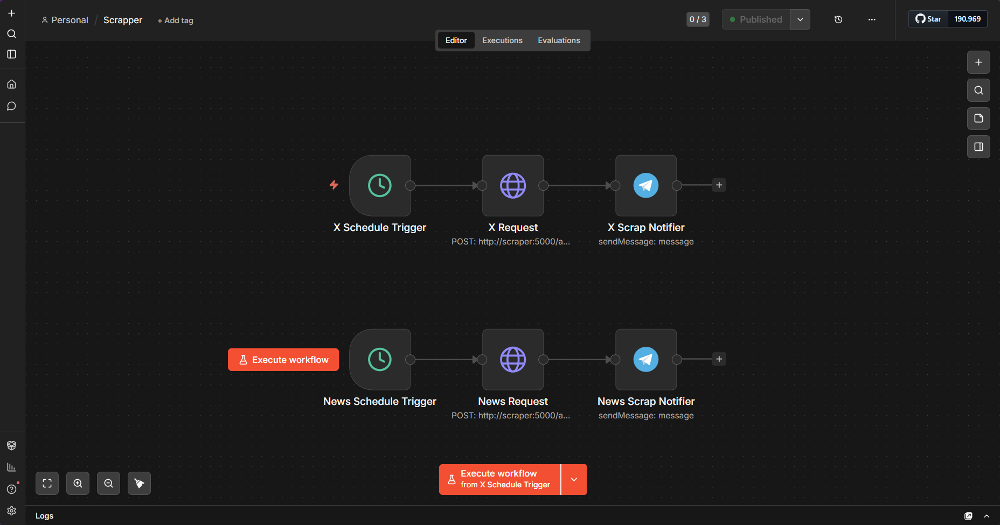
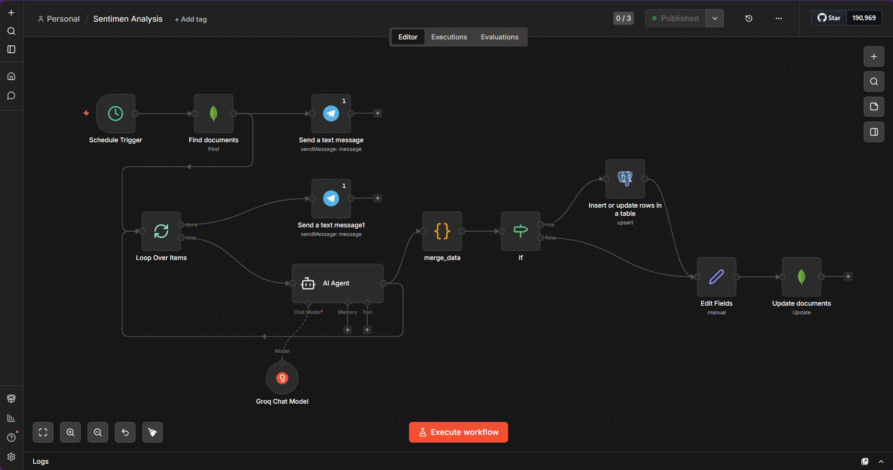
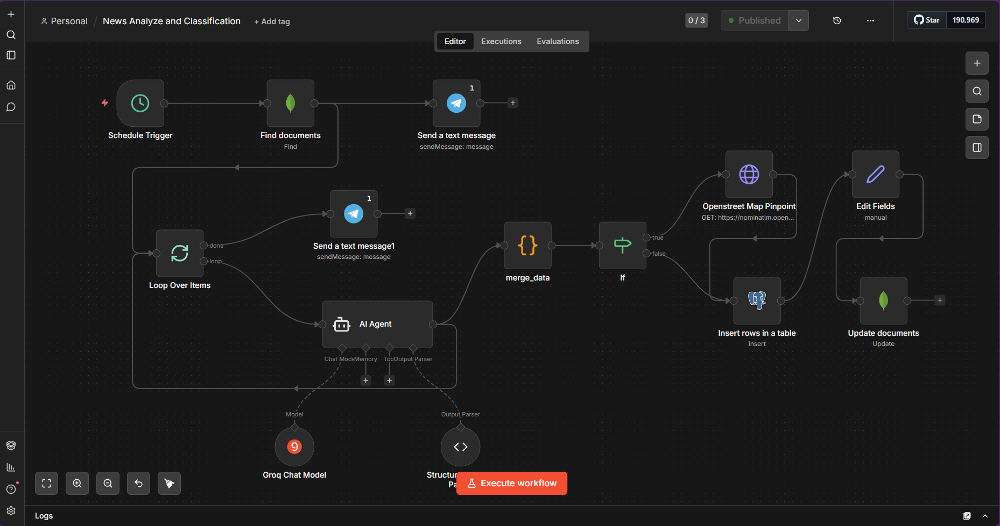
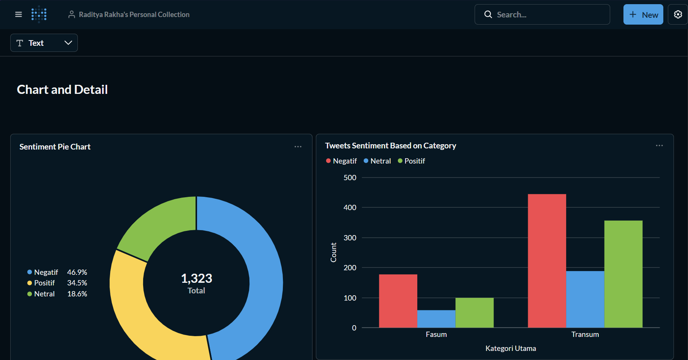
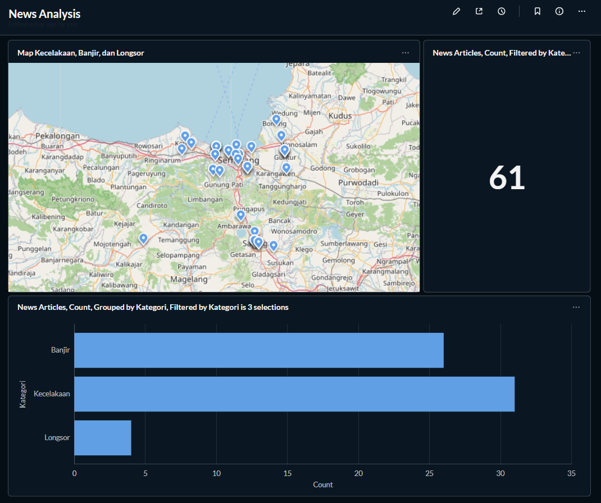

# Big Data Project — Analisis Sentimen & Berita Kota Semarang

Sistem big data berbasis pipeline otomatis untuk mengumpulkan, menganalisis, dan memvisualisasikan data dari Twitter/X dan berita lokal (Radar Semarang) terkait isu transportasi umum dan fasilitas umum di Kota Semarang.

---

## Deskripsi Proyek

Proyek ini membangun sebuah pipeline data end-to-end yang terdiri dari:

1. **Pengumpulan Data** — Scraping tweet dari Twitter/X dan artikel berita dari Radar Semarang secara otomatis dan terjadwal.
2. **Penyimpanan Data** — Data mentah disimpan di MongoDB (data lake), hasil analisis disimpan di PostgreSQL (data warehouse).
3. **Analisis & Klasifikasi** — AI Agent (Groq LLM) menganalisis sentimen tweet dan mengklasifikasikan berita berdasarkan kategori (Banjir, Kecelakaan, Longsor, dll) serta mengekstrak lokasi geografis.
4. **Visualisasi** — Dashboard interaktif di Metabase menampilkan peta lokasi kejadian, distribusi sentimen, dan statistik berita.
5. **Notifikasi WhatsApp** — Laporan otomatis dikirim ke WhatsApp via WAHA + n8n.

---

## Arsitektur Sistem

```
Twitter/X ──────────┐
                    ▼
Radar Semarang ──► Scraper API (FastAPI + Playwright)
                    │
                    ▼
              MongoDB (Data Lake)
                    │
                    ▼
            n8n Automation Engine
           ┌────────┴────────┐
           ▼                 ▼
    Sentiment Analysis  News Analysis &
    (Groq LLM)          Classification (Groq LLM)
           │                 │
           └────────┬────────┘
                    ▼
            PostgreSQL (Data Warehouse)
                    │
                    ▼
              Metabase Dashboard
                    │
                    ▼
         WhatsApp Notification (WAHA)
```

---

## Komponen & Teknologi

| Komponen | Teknologi | Fungsi |
|---|---|---|
| Scraper | FastAPI + Playwright | Scraping Twitter/X & Radar Semarang |
| Data Lake | MongoDB | Penyimpanan data mentah (tweet & berita) |
| Data Warehouse | PostgreSQL | Penyimpanan hasil analisis terstruktur |
| Orchestration | n8n | Automasi pipeline & penjadwalan |
| AI Analysis | Groq (LLaMA) | Analisis sentimen & klasifikasi berita |
| Visualisasi | Metabase | Dashboard & peta interaktif |
| WhatsApp API | WAHA | Notifikasi hasil analisis |
| Deployment | Docker Compose + GitHub Actions | CI/CD ke VPS IDCloudHost |
| Map Geocoding | Nominatim (OpenStreetMap) | Konversi nama lokasi ke koordinat |

---

## Alur Pipeline

### 1. Scraping Data (n8n → Scraper API)

n8n menjalankan dua workflow terjadwal:

- **X (Twitter) Scraper** — Memanggil `POST /api/twitter/scrape` dengan query terkait fasilitas umum dan transportasi Semarang. Hasil disimpan ke MongoDB collection `tweets`.
- **News Scraper** — Memanggil `POST /api/news/scrape-auto` untuk mengambil artikel dari Radar Semarang (kategori: Kecelakaan, Banjir, Gempa, Kebakaran). Hasil disimpan ke MongoDB collection `news`.

### 2. Analisis Sentimen (Tweet)

n8n workflow **Sentimen Analysis** berjalan terjadwal:
1. Ambil tweet dari MongoDB yang belum dianalisis
2. Loop setiap tweet → AI Agent (Groq) mengklasifikasikan sentimen: **Positif / Negatif / Netral**
3. Hasil di-upsert ke tabel `tweets` di PostgreSQL
4. Notifikasi progres dikirim via WhatsApp

### 3. Analisis & Klasifikasi Berita

n8n workflow **News Analyze and Classification** berjalan terjadwal:
1. Ambil artikel berita dari MongoDB yang belum diproses
2. Loop setiap artikel → AI Agent mengklasifikasikan kategori (Banjir, Kecelakaan, Longsor, dll) dan mengekstrak nama lokasi
3. Nominatim API mengkonversi nama lokasi → koordinat (lat/lon)
4. Data diinsert ke tabel `news` di PostgreSQL dengan koordinat lokasi
5. MongoDB diupdate status `processed = true`

---

## n8n Workflows

### Chatbot (WhatsApp AI Assistant)
Chatbot WhatsApp berbasis AI yang menjawab pertanyaan pengguna menggunakan data dari database (Twitter & berita). Menggunakan dua AI Agent — satu untuk query Twitter, satu untuk query berita.



### Scrapper
Workflow terjadwal untuk memicu scraping Twitter/X dan Radar Semarang secara periodik, dengan notifikasi Telegram setelah selesai.



### Sentimen Analysis
Pipeline analisis sentimen tweet dengan Groq LLM. Setiap tweet diloop, dianalisis, lalu di-upsert ke PostgreSQL.



### News Analyze and Classification
Pipeline klasifikasi berita, ekstraksi lokasi, geocoding via Nominatim, dan penyimpanan ke PostgreSQL.



---

## Dashboard & Visualisasi

### Analisis Sentimen Tweet

Dashboard Metabase menampilkan distribusi sentimen dari **1.323 tweet** yang dikumpulkan:

| Sentimen | Jumlah | Persentase |
|---|---|---|
| Negatif | ~620 | 46.9% |
| Positif | ~456 | 34.5% |
| Netral | ~247 | 18.6% |

Breakdown sentimen per kategori (Fasilitas Umum vs Transportasi Umum) tersedia dalam bar chart.



### Analisis Berita & Peta Lokasi

Dashboard peta interaktif menampilkan lokasi kejadian (Kecelakaan, Banjir, Longsor) di wilayah Semarang, dengan total **61 artikel** yang terpetakan beserta statistik jumlah artikel per kategori.



---

## Struktur Repository

```
big-data/
├── .github/
│   └── workflows/
│       └── deploy.yml          # CI/CD GitHub Actions → VPS
├── scraper/
│   ├── main.py                 # FastAPI app + endpoint scraper
│   ├── scraper.py              # Logic scraping Twitter/X (Playwright)
│   ├── scraper_news.py         # Logic scraping Radar Semarang
│   ├── Dockerfile
│   └── requirements.txt
├── public/
│   ├── fasum.JPG               # Gambar kategori fasilitas umum
│   └── transum.jpg             # Gambar kategori transportasi umum
├── docs/                       # Screenshot workflow & dashboard
├── docker-compose.yml          # Definisi seluruh layanan
└── README.md
```

---

## Services & Port

| Service | Port | Keterangan |
|---|---|---|
| Scraper API | 5000 | FastAPI endpoint scraping |
| n8n | 5678 | Automation engine |
| Metabase | 3000 | Dashboard visualisasi |
| MongoDB | 27017 | Data lake |
| Mongo Express | 8081 | GUI MongoDB |
| PostgreSQL | - | Data warehouse (internal) |
| pgAdmin | 5050 | GUI PostgreSQL |
| WAHA | 3003 | WhatsApp HTTP API |
| Static Server | 8080 | Nginx file server |

---

## Deployment

Project di-deploy ke VPS IDCloudHost menggunakan Docker Compose. Setiap push ke branch `main` otomatis men-trigger deploy via GitHub Actions.

```bash
# Clone repo
git clone https://github.com/lexiiyz/big-data.git
cd big-data

# Setup environment
cp .env.example .env
# Edit .env sesuai konfigurasi

# Jalankan semua service
docker compose up -d

# Cek status
docker compose ps
```

### Environment Variables

| Variable | Keterangan |
|---|---|
| `MONGO_USER` | Username MongoDB |
| `MONGO_PASSWORD` | Password MongoDB |
| `POSTGRES_USER` | Username PostgreSQL |
| `POSTGRES_PASSWORD` | Password PostgreSQL |
| `GROQ_API_KEY` | API key Groq LLM |
| `WAHA_API_KEY` | API key WAHA |
| `WAHA_DASHBOARD_USERNAME` | Username dashboard WAHA |
| `WAHA_DASHBOARD_PASSWORD` | Password dashboard WAHA |
| `N8N_HOST` | Hostname/IP server n8n |
| `PGADMIN_EMAIL` | Email login pgAdmin |
| `PGADMIN_PASSWORD` | Password pgAdmin |
| `ME_USER` | Username Mongo Express |
| `ME_PASSWORD` | Password Mongo Express |

---

## Scraper API Endpoints

| Method | Endpoint | Keterangan |
|---|---|---|
| `POST` | `/api/twitter/scrape` | Trigger scraping Twitter/X |
| `POST` | `/api/news/scrape-auto` | Trigger scraping Radar Semarang |
| `GET` | `/health` | Health check |

### Contoh Request Twitter Scrape

```json
POST /api/twitter/scrape
{
  "query": "fasilitas umum semarang",
  "max_tweets": 50,
  "topic": "Fasum",
  "lang": "id"
}
```

### Contoh Request News Scrape

```json
POST /api/news/scrape-auto
{
  "queries": ["Kecelakaan", "Banjir"],
  "max_pages": 3
}
```
